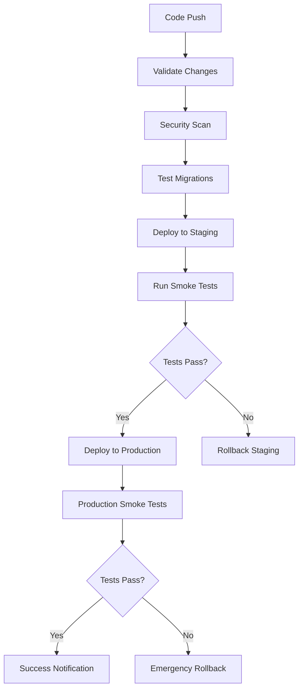

# Database Deployment Automation Documentation

## Overview

This document provides comprehensive guidance for the automated PostgreSQL database deployment system for the Hokm game server. The automation ensures consistent, reliable, and safe database deployments across all environments.

## Table of Contents

1. [Architecture](#architecture)
2. [Environment Setup](#environment-setup)
3. [Secret Management](#secret-management)
4. [Deployment Process](#deployment-process)
5. [Migration Management](#migration-management)
6. [Backup and Recovery](#backup-and-recovery)
7. [Monitoring and Alerting](#monitoring-and-alerting)
8. [Rollback Procedures](#rollback-procedures)
9. [Security Considerations](#security-considerations)
10. [Troubleshooting](#troubleshooting)
11. [Operational Runbooks](#operational-runbooks)

## Architecture

### Components

The database deployment automation consists of several key components:

```
database/
├── deploy.py              # Main deployment orchestration
├── seed_data.py          # Data seeding for different environments
├── smoke_tests.py        # Post-deployment validation
├── rollback.py           # Rollback and recovery procedures
├── config/               # Environment-specific configurations
│   ├── development.json
│   ├── testing.json
│   ├── staging.json
│   └── production.json
└── backups/              # Backup storage (local development)

.github/workflows/
└── database.yml          # CI/CD pipeline for database changes

tests/
├── migration_framework.py    # Migration orchestration
└── data_migration_utils.py   # Data migration utilities
```

### CI/CD Pipeline Flow



## Environment Setup

### Prerequisites

1. **Python 3.11+** with required dependencies
2. **PostgreSQL 15+** server access
3. **AWS CLI** (for S3 backup storage in staging/production)
4. **Environment variables** configured
5. **SSL certificates** (for staging/production)

### Installation

1. Install Python dependencies:
```bash
pip install -r requirements.txt
pip install -r requirements-postgresql.txt
```

2. Set up environment variables:
```bash
# Copy example environment file
cp .env.database.example .env.database

# Edit with your configuration
vim .env.database
```

3. Configure database access:
```bash
# Development
export DB_HOST=localhost
export DB_PASSWORD_DEV=your_dev_password

# Staging
export DB_HOST_STAGING=staging.db.hokm.com
export DB_PASSWORD_STAGING=your_staging_password

# Production
export DB_HOST_PRODUCTION=production.db.hokm.com
export DB_PASSWORD_PRODUCTION=your_production_password
```

### Environment-Specific Setup

#### Development
```bash
# Create development database
createdb hokm_game_dev

# Run initial setup
python database/deploy.py --environment development --setup

# Seed with development data
python database/seed_data.py --environment development
```

#### Testing
```bash
# Create test database
createdb hokm_game_test

# Run test setup with cleanup
python database/deploy.py --environment testing --setup
python database/seed_data.py --environment testing --clear
```

#### Staging
```bash
# Staging deployment (requires approval)
python database/deploy.py --environment staging --config database/config/staging.json

# Verify deployment
python database/smoke_tests.py --environment staging
```

#### Production
```bash
# Production deployment (requires multiple approvals)
python database/deploy.py --environment production --config database/config/production.json

# Monitor deployment
tail -f production_deployment.log
```

## Secret Management

### Environment Variables

All sensitive information is managed through environment variables:

```bash
# Database credentials
DB_PASSWORD_DEV=development_password
DB_PASSWORD_TEST=test_password
DB_PASSWORD_STAGING=staging_secure_password
DB_PASSWORD_PRODUCTION=production_ultra_secure_password

# Backup encryption
BACKUP_ENCRYPTION_KEY=your_backup_encryption_key

# S3 backup storage
S3_BACKUP_BUCKET_STAGING=hokm-db-backups-staging
S3_BACKUP_BUCKET_PRODUCTION=hokm-db-backups-production

# Notification webhooks
SLACK_WEBHOOK_STAGING=https://hooks.slack.com/staging
SLACK_WEBHOOK_PRODUCTION=https://hooks.slack.com/production
```

### GitHub Secrets

For CI/CD pipeline, configure these secrets in GitHub:

```
DB_HOST_STAGING
DB_PASSWORD_STAGING
DB_HOST_PRODUCTION
DB_PASSWORD_PRODUCTION
BACKUP_ENCRYPTION_KEY
S3_BACKUP_BUCKET_STAGING
S3_BACKUP_BUCKET_PRODUCTION
SLACK_WEBHOOK_STAGING
SLACK_WEBHOOK_PRODUCTION
AWS_ACCESS_KEY_ID
AWS_SECRET_ACCESS_KEY
```

### Secret Rotation

1. **Regular Rotation Schedule**:
   - Development: 90 days
   - Staging: 60 days
   - Production: 30 days

2. **Emergency Rotation Process**:
```bash
# Generate new password
NEW_PASSWORD=$(openssl rand -base64 32)

# Update database
ALTER USER hokm_production PASSWORD '$NEW_PASSWORD';

# Update environment variables
export DB_PASSWORD_PRODUCTION=$NEW_PASSWORD

# Update GitHub secrets
# Update configuration management system
```

## Deployment Process

### Automated Deployment

The deployment process is fully automated through the CI/CD pipeline:

1. **Trigger**: Push to main/staging branch or manual workflow dispatch
2. **Validation**: Schema validation, security scanning, syntax checking
3. **Testing**: Migration testing on temporary database
4. **Staging Deployment**: Automatic deployment to staging environment
5. **Smoke Tests**: Comprehensive post-deployment validation
6. **Production Deployment**: Manual approval required
7. **Monitoring**: Real-time monitoring and alerting

### Manual Deployment

For emergency deployments or maintenance:

```bash
# Deploy to specific environment
python database/deploy.py --environment production \
  --config database/config/production.json \
  --backup-before-deploy \
  --run-smoke-tests

# Deploy specific migration
python database/deploy.py --environment staging \
  --target-revision abc123def456 \
  --dry-run

# Force deployment (use with caution)
python database/deploy.py --environment development \
  --force \
  --skip-backup
```

### Deployment Options

```bash
# Basic deployment
python database/deploy.py --environment staging

# Deployment with custom configuration
python database/deploy.py --environment staging \
  --config /path/to/config.json

# Dry run (validation only)
python database/deploy.py --environment staging --dry-run

# Deploy with maintenance mode
python database/deploy.py --environment production \
  --maintenance-mode \
  --max-downtime 300

# Deploy with backup
python database/deploy.py --environment production \
  --backup-before-deploy \
  --backup-retention 30
```

## Migration Management

### Creating Migrations

```bash
# Generate new migration
alembic revision --autogenerate -m "Add user preferences table"

# Create empty migration
alembic revision -m "Custom data migration"

# Review generated migration
vim tests/migrations/versions/001_add_user_preferences.py
```

### Migration Best Practices

1. **Always review auto-generated migrations**
2. **Test migrations on staging first**
3. **Use transactions for data migrations**
4. **Include rollback logic**
5. **Test rollback procedures**

### Example Migration

```python
"""Add user preferences table

Revision ID: 001_add_user_preferences
Revises: base
Create Date: 2024-01-15 10:30:00.000000
"""

from alembic import op
import sqlalchemy as sa
from sqlalchemy.dialects import postgresql

# revision identifiers
revision = '001_add_user_preferences'
down_revision = 'base'
branch_labels = None
depends_on = None

def upgrade():
    # Create table
    op.create_table('user_preferences',
        sa.Column('id', postgresql.UUID(as_uuid=True), primary_key=True),
        sa.Column('user_id', postgresql.UUID(as_uuid=True), nullable=False),
        sa.Column('preferences', postgresql.JSONB(), nullable=False),
        sa.Column('created_at', sa.DateTime(timezone=True), server_default=sa.func.now()),
        sa.Column('updated_at', sa.DateTime(timezone=True), server_default=sa.func.now())
    )
    
    # Add foreign key
    op.create_foreign_key(
        'fk_user_preferences_user_id',
        'user_preferences', 'users',
        ['user_id'], ['id'],
        ondelete='CASCADE'
    )
    
    # Add index
    op.create_index('idx_user_preferences_user_id', 'user_preferences', ['user_id'])

def downgrade():
    # Drop table (cascades will handle constraints)
    op.drop_table('user_preferences')
```

## Backup and Recovery

### Automatic Backups

Backups are automatically created:
- **Before each deployment**
- **On schedule** (hourly for production, daily for staging)
- **Before rollback operations**

### Manual Backup

```bash
# Create backup
pg_dump -h production.db.hokm.com -U hokm_production \
  --format=custom --compress --verbose \
  --file=/backups/manual_backup_$(date +%Y%m%d_%H%M%S).sql \
  hokm_game_production

# Upload to S3
aws s3 cp /backups/manual_backup_*.sql \
  s3://hokm-db-backups-production/manual/
```

### Recovery Procedures

#### Point-in-Time Recovery

```bash
# Restore to specific timestamp
python database/rollback.py restore \
  --environment production \
  --backup-file s3://hokm-db-backups-production/2024-01-15/backup_20240115_143000.sql \
  --point-in-time "2024-01-15 14:30:00"
```

#### Full Database Restore

```bash
# Emergency restore from latest backup
python database/rollback.py emergency \
  --environment production \
  "Critical data corruption detected"

# Restore from specific backup
python database/rollback.py restore \
  --environment production \
  /backups/backup_production_20240115_120000.sql
```

### Backup Verification

```bash
# Verify backup integrity
python database/smoke_tests.py --environment testing \
  --restore-from-backup /path/to/backup.sql

# Test restore procedure
python database/rollback.py restore \
  --environment testing \
  --backup-file /path/to/backup.sql \
  --dry-run
```

## Monitoring and Alerting

### Deployment Monitoring

The system provides comprehensive monitoring:

1. **Real-time deployment status**
2. **Performance metrics**
3. **Error tracking**
4. **Resource utilization**
5. **Connection pool monitoring**

### Alert Configuration

#### Slack Notifications

```json
{
  "notifications": {
    "enabled": true,
    "slack_webhook": "${SLACK_WEBHOOK_PRODUCTION}",
    "notify_on_success": true,
    "notify_on_failure": true,
    "critical_alerts": true
  }
}
```

#### Email Alerts

```json
{
  "notifications": {
    "email_recipients": [
      "production-team@hokm.com",
      "devops@hokm.com",
      "cto@hokm.com"
    ]
  }
}
```

### Health Checks

```bash
# Run health check
python database/smoke_tests.py --environment production

# Monitor specific metrics
python -c "
from database.smoke_tests import DatabaseSmokeTests
import asyncio

async def check():
    smoke_tests = DatabaseSmokeTests('production')
    result = await smoke_tests.test_performance_baseline()
    print(f'Performance: {result}')

asyncio.run(check())
"
```

## Rollback Procedures

### Automatic Rollback

The system automatically rolls back on:
- **Smoke test failures**
- **Deployment timeouts**
- **Critical errors during deployment**

### Manual Rollback

#### Migration Rollback

```bash
# Rollback last migration
python database/rollback.py migration --environment production --steps 1

# Rollback to specific revision
python database/rollback.py migration --environment production \
  --revision abc123def456

# Rollback multiple steps
python database/rollback.py migration --environment production --steps 3
```

#### Emergency Rollback

```bash
# Emergency rollback with reason
python database/rollback.py emergency --environment production \
  "Database performance degradation detected"

# This will:
# 1. Find latest stable backup
# 2. Restore database
# 3. Validate restoration
# 4. Send critical alerts
```

### Rollback Validation

After any rollback:

1. **Automatic smoke tests**
2. **Data integrity checks**
3. **Performance validation**
4. **Security verification**
5. **Notification to stakeholders**

## Security Considerations

### Connection Security

1. **SSL/TLS encryption** for all database connections
2. **Certificate validation** in staging/production
3. **Connection pooling** with secure configurations
4. **Network isolation** and firewall rules

### Access Control

1. **Principle of least privilege**
2. **Separate users per environment**
3. **Role-based access control**
4. **Regular access audits**

### Data Protection

1. **Backup encryption** with separate keys
2. **Secrets management** through environment variables
3. **Audit logging** for all database operations
4. **GDPR compliance** features

### Security Monitoring

```bash
# Security scan
bandit -r database/ -f json -o security-report.json

# Vulnerability assessment
safety check --json --output vulnerability-report.json

# Access audit
python -c "
import asyncio
from database.smoke_tests import DatabaseSmokeTests

async def audit():
    tests = DatabaseSmokeTests('production')
    result = await tests.test_security_config()
    print(f'Security Status: {result}')

asyncio.run(audit())
"
```

## Troubleshooting

### Common Issues

#### Connection Issues

```bash
# Test database connectivity
python -c "
import asyncio
from database.smoke_tests import DatabaseSmokeTests

async def test():
    tests = DatabaseSmokeTests('production')
    result = await tests.test_basic_connection()
    print(result)

asyncio.run(test())
"
```

#### Migration Issues

```bash
# Check migration status
alembic current

# Show migration history
alembic history

# Resolve migration conflicts
alembic merge -m "Merge conflicting migrations" head1 head2
```

#### Performance Issues

```bash
# Run performance diagnostic
python database/smoke_tests.py --environment production | grep performance

# Check connection pool status
python -c "
import asyncio
from database.smoke_tests import DatabaseSmokeTests

async def check_pool():
    tests = DatabaseSmokeTests('production')
    result = await tests.test_connection_pool()
    print(f'Pool Status: {result}')

asyncio.run(check_pool())
"
```

### Debugging Steps

1. **Check logs**: `tail -f deployment_*.log`
2. **Verify configuration**: `python database/deploy.py --environment production --validate-config`
3. **Test connections**: `python database/smoke_tests.py --environment production`
4. **Check migration status**: `alembic current`
5. **Verify backups**: `python database/rollback.py list-backups`

### Emergency Contacts

- **Database Team**: db-team@hokm.com
- **DevOps Team**: devops@hokm.com
- **On-Call Engineer**: +1-555-ONCALL
- **Slack Channel**: #database-alerts

## Operational Runbooks

### Daily Operations

#### Morning Checklist

```bash
#!/bin/bash
# Daily database health check

echo "=== Daily Database Health Check ==="
echo "Date: $(date)"

# Check all environments
for env in development staging production; do
    echo "Checking $env..."
    python database/smoke_tests.py --environment $env --output /tmp/health_$env.json
done

# Check backup status
python database/rollback.py list-backups | head -10

# Clean up old backups
python database/rollback.py cleanup

echo "Health check completed"
```

#### Weekly Maintenance

```bash
#!/bin/bash
# Weekly database maintenance

echo "=== Weekly Database Maintenance ==="

# Update statistics
for env in staging production; do
    echo "Updating statistics for $env..."
    # Add your maintenance queries here
done

# Security audit
python database/smoke_tests.py --environment production | grep security

# Performance review
python database/smoke_tests.py --environment production | grep performance

echo "Weekly maintenance completed"
```

### Incident Response

#### Critical Database Issue

1. **Immediate Assessment**
   ```bash
   # Check system status
   python database/smoke_tests.py --environment production
   
   # Check recent deployments
   tail -100 deployment_production_*.log
   ```

2. **Emergency Response**
   ```bash
   # If database is corrupted or unresponsive
   python database/rollback.py emergency production "Critical system failure"
   ```

3. **Communication**
   - Post in #database-alerts Slack channel
   - Email production-team@hokm.com
   - Update status page

4. **Post-Incident**
   - Document issue and resolution
   - Review and improve procedures
   - Schedule post-mortem meeting

### Deployment Day Procedures

#### Pre-Deployment

```bash
# 1. Verify staging deployment
python database/smoke_tests.py --environment staging

# 2. Check production health
python database/smoke_tests.py --environment production

# 3. Verify backup systems
python database/rollback.py list-backups

# 4. Notify stakeholders
# Send deployment notification
```

#### During Deployment

```bash
# 1. Monitor deployment logs
tail -f deployment_production_*.log

# 2. Watch system metrics
# Monitor your monitoring system

# 3. Be ready for rollback
# Keep rollback command ready
```

#### Post-Deployment

```bash
# 1. Run smoke tests
python database/smoke_tests.py --environment production

# 2. Verify application functionality
# Test critical user flows

# 3. Monitor for issues
# Watch logs and metrics for 1 hour

# 4. Send completion notification
# Notify stakeholders of successful deployment
```

## Configuration Reference

### Environment Variables

| Variable | Description | Required | Default |
|----------|-------------|----------|---------|
| `DB_HOST` | Database host | Yes | localhost |
| `DB_PORT` | Database port | No | 5432 |
| `DB_NAME` | Database name | Yes | hokm_game |
| `DB_USER` | Database username | Yes | hokm_app |
| `DB_PASSWORD_*` | Database password per environment | Yes | - |
| `BACKUP_ENCRYPTION_KEY` | Backup encryption key | Staging/Prod | - |
| `S3_BACKUP_BUCKET_*` | S3 backup bucket per environment | Staging/Prod | - |
| `SLACK_WEBHOOK_*` | Slack webhook per environment | No | - |

### Command Reference

| Command | Description | Example |
|---------|-------------|---------|
| `deploy.py` | Main deployment script | `python database/deploy.py --environment production` |
| `seed_data.py` | Database seeding | `python database/seed_data.py --environment development` |
| `smoke_tests.py` | Health checks | `python database/smoke_tests.py --environment production` |
| `rollback.py` | Rollback operations | `python database/rollback.py migration --steps 1` |

### Configuration Files

Each environment has its own configuration file in `database/config/`:
- `development.json` - Local development settings
- `testing.json` - Test environment settings
- `staging.json` - Staging environment settings
- `production.json` - Production environment settings

---

## Support and Maintenance

For questions, issues, or contributions:

- **Documentation**: This file and inline code comments
- **Issues**: Create GitHub issues for bugs or feature requests  
- **Support**: Contact the database team at db-team@hokm.com
- **Emergency**: Use the on-call procedures above

Remember to keep this documentation updated as the system evolves!
